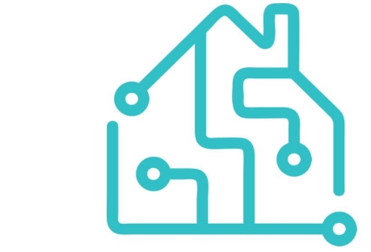
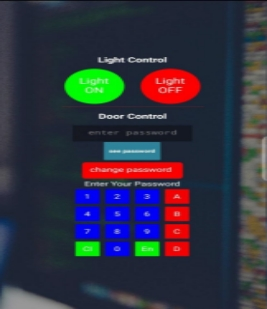

**User Guide**

Smart door lock and lighting system

**Preface**

Our system consists of Esp32, a keypad, and an Application, which interact with each other and with the user to achieve Its mission, which is the ability to control the lock of the door and light system.

The user should be able to control the system lock through two different methods:

- Direct Control (Keypad).
- Wireless Control (Mobile Application).

And to control the lighting system through:

- Wireless Control (Mobile Application).

**System lock control**

**Keypad**

- The numbers are used to input the password.
- The ‘#’ to submit the input password.
- The ‘\*’ to clear the input password.

**Application**

- The numbers are used to input the password.
- The “En” to submit the input password.
- The “Cl” to clear the input password.

**Facilities**

For a more comfortable using experience, we have added a change password facility.

Using this facility by clicking on the “Change password” button, then entering your new password.

For adding more reliability we have added three master keys you can use by using the keypad.

**System lighting control**

- By clicking on the “light on” button: house lights turn on.
- By clicking on the “light off” button: house lights turn off.
3
